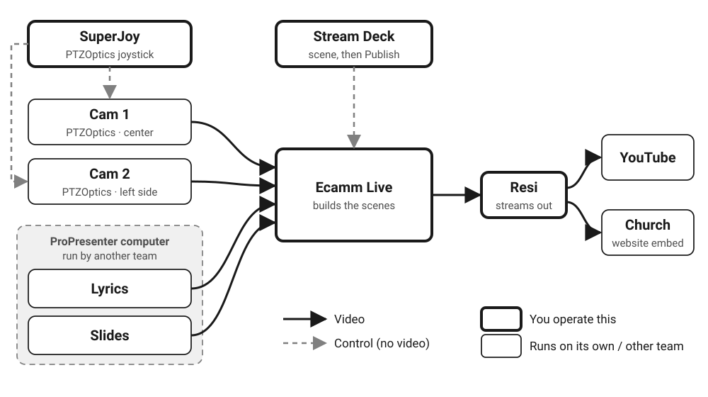

# How It Works

The signal flow from cameras and ProPresenter through Ecamm and Resi, the four sources, and who does what.

## Signal flow

<figure markdown="span">
  
  <figcaption>How the picture gets from the room to viewers. Thick boxes are the parts you operate. Solid arrows carry video; dashed arrows only send commands.</figcaption>
</figure>
