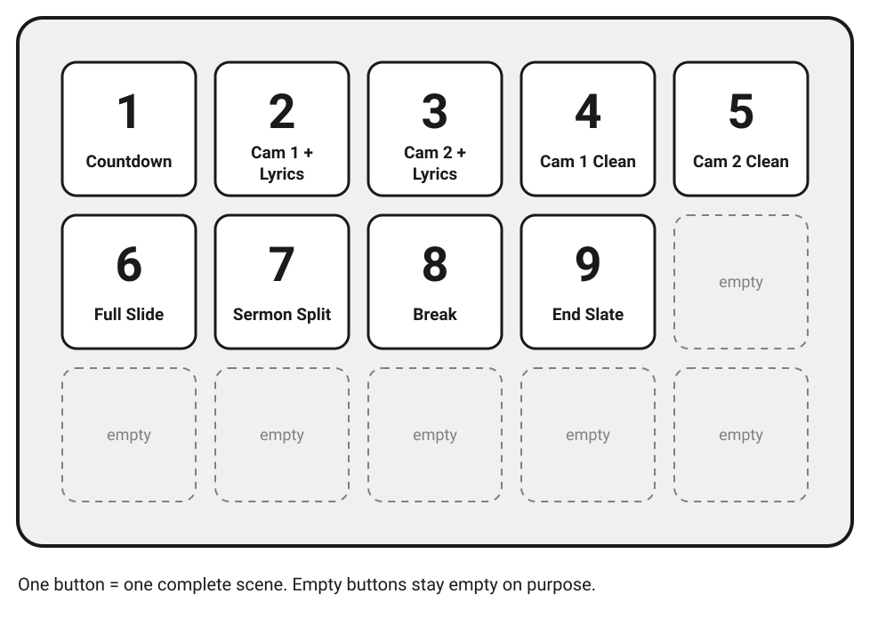
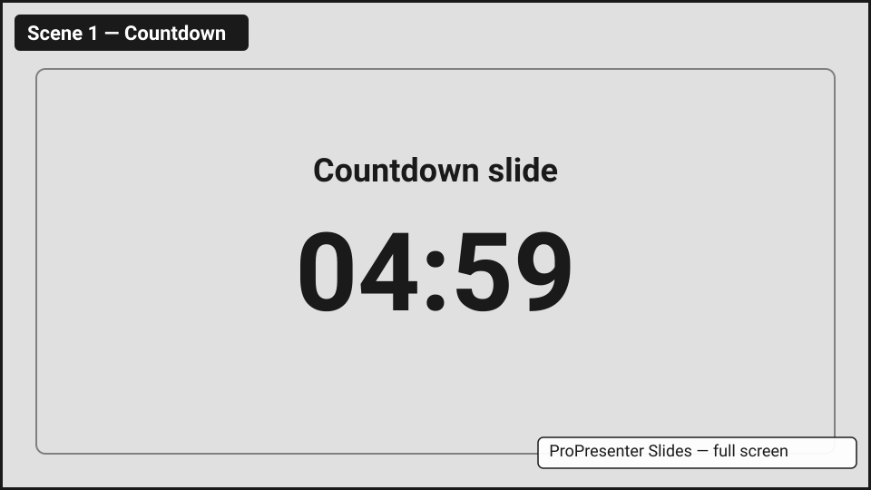
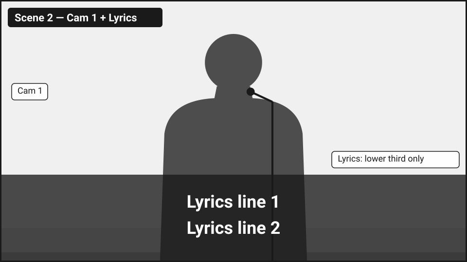
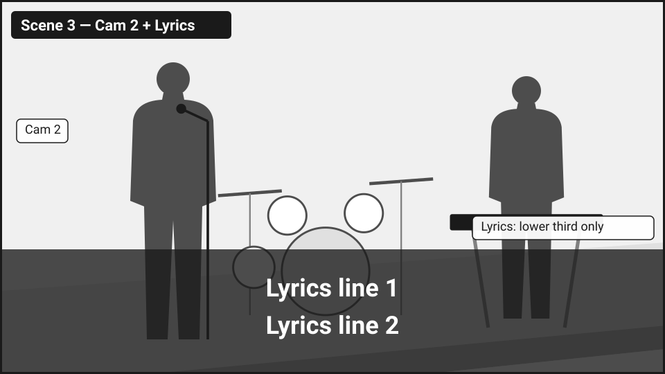
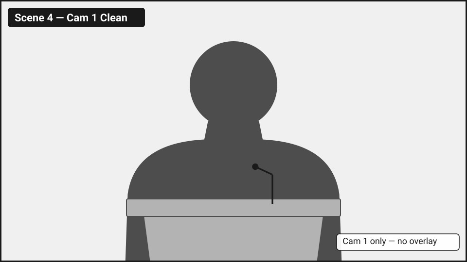
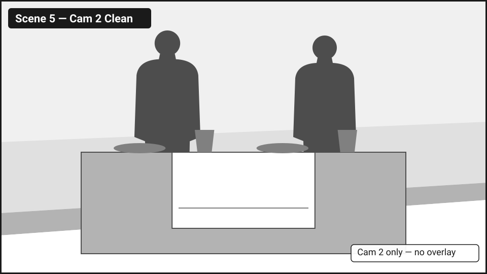
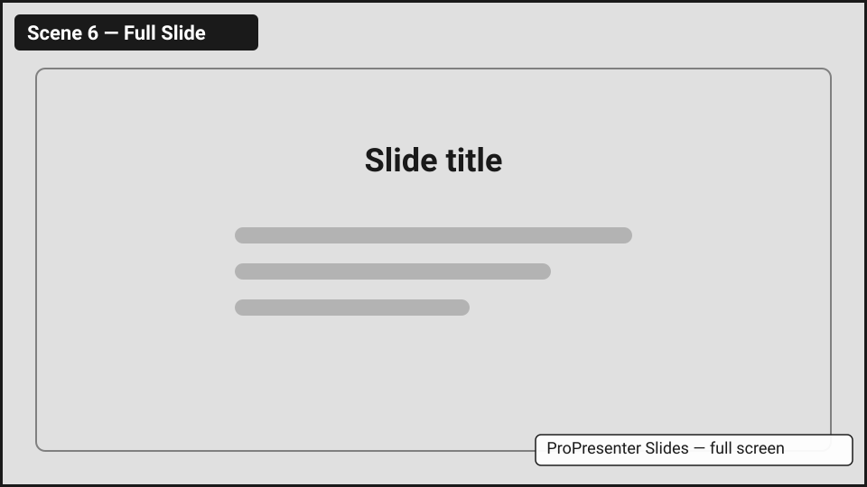
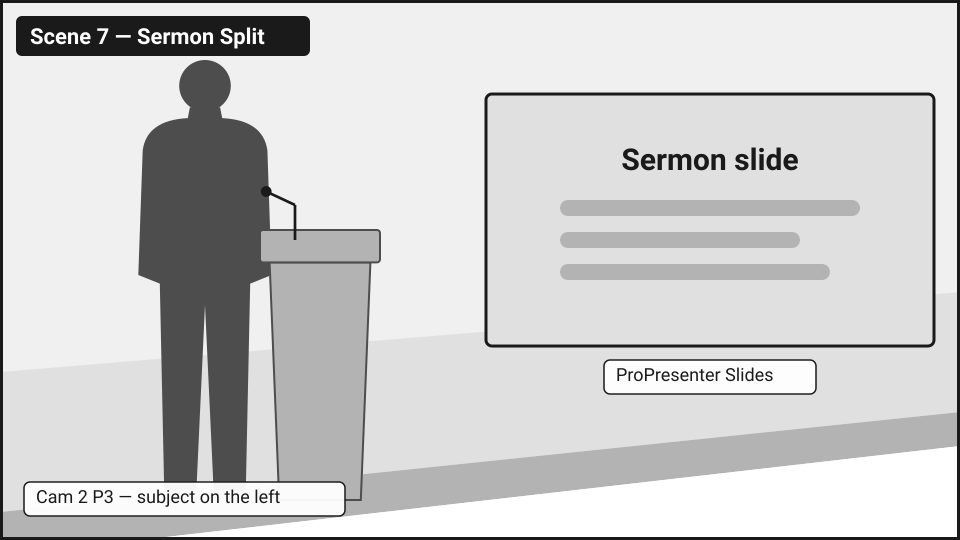
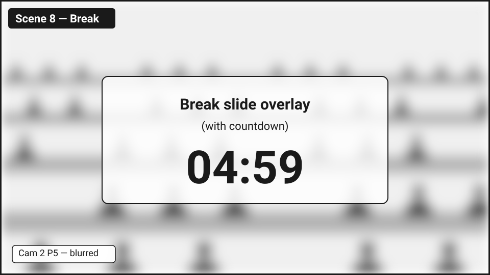
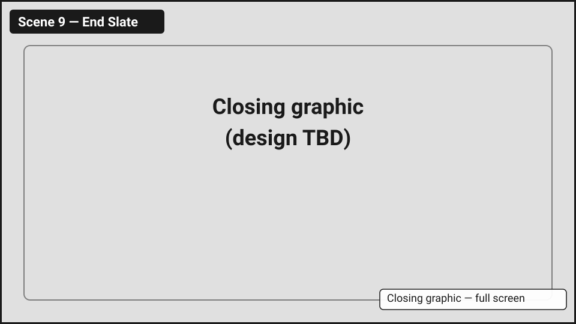

# Scenes

This page shows each Ecamm scene: what it looks like, when to use it, and when not to.

A **scene** is a complete picture built in Ecamm Live. One Stream Deck button gives you one finished scene. For other video terms, see [Video Basics](video-basics.md).

## One button, one scene

Each scene is already built: the right camera, the right overlay, in the right place. You never add or remove parts of a scene during the service. You press one button and get the whole picture.

This keeps every Sunday the same. It also means that one button press can't leave a half-built picture on air.

<figure markdown="span">
  
  <figcaption>The Stream Deck. Scenes 1–5 are on the top row and 6–9 on the second row. The other buttons stay empty on purpose, so you can't press something unexpected.</figcaption>
</figure>

PHOTO NEEDED: stream-deck.jpg

Before you press a camera scene, make sure that camera is already on the right preset. Scenes don't move cameras. Presets do.

## Scene 1 — Countdown

<figure markdown="span">
  
  <figcaption>ProPresenter's countdown slide, full screen. On air before the service starts.</figcaption>
</figure>

PHOTO NEEDED: scene-1-countdown.jpg

- **Use it:** from when you start broadcasting until the first song. It must be on air before T-30, when Resi starts by itself.
- **Don't use it:** once the service has started. If something breaks mid-service, use a safe scene from [When Things Go Wrong](when-things-go-wrong.md) instead.
- **Live camera:** none. Both cameras are free to move.

## Scene 2 — Cam 1 + Lyrics

<figure markdown="span">
  
  <figcaption>Cam 1 with the lyrics in a bar across the bottom third. Lyrics never go full screen.</figcaption>
</figure>

PHOTO NEEDED: scene-2-cam1-lyrics.jpg

- **Use it:** during songs, with Cam 1 P1 or Cam 1 P2.
- **Don't use it:** when nobody is singing. The lyrics bar belongs to songs.
- **Live camera:** Cam 1. Don't move it. Get Cam 2 ready instead.

## Scene 3 — Cam 2 + Lyrics

<figure markdown="span">
  
  <figcaption>Cam 2 with the lyrics in a bar across the bottom third.</figcaption>
</figure>

PHOTO NEEDED: scene-3-cam2-lyrics.jpg

- **Use it:** during songs, with Cam 2 P1 or Cam 2 P2. Switch between Scene 2 and Scene 3 to give viewers variety.
- **Don't use it:** when nobody is singing.
- **Live camera:** Cam 2. Don't move it. Get Cam 1 ready instead.

## Scene 4 — Cam 1 Clean

<figure markdown="span">
  
  <figcaption>Cam 1 only, with nothing on top. Shown here on Cam 1 P3.</figcaption>
</figure>

PHOTO NEEDED: scene-4-cam1-clean.jpg

- **Use it:** for announcements (Cam 1 P4), the Sunday school dismissal (Cam 1 P2), the sermon when no slide is up (Cam 1 P3), and the benediction (proposed: Cam 1 P1, TBD).
- **Don't use it:** during songs. Use Scene 2 so viewers get the lyrics.
- **Live camera:** Cam 1. Don't move it.

This is the scene you'll use most. Before you press it, check that Cam 1 is on the right preset for the moment.

## Scene 5 — Cam 2 Clean

<figure markdown="span">
  
  <figcaption>Cam 2 only, with nothing on top. Shown here on Cam 2 P4 (communion).</figcaption>
</figure>

PHOTO NEEDED: scene-5-cam2-clean.jpg

- **Use it:** for communion (monthly), with Cam 2 P4. Also useful on Cam 2 P1 for a few seconds while you move Cam 1, when no other scene fits.
- **Don't use it:** with Cam 2 P5 (the congregation). That shot is only shown blurred, in Scene 8.
- **Live camera:** Cam 2. Don't move it.

## Scene 6 — Full Slide

<figure markdown="span">
  
  <figcaption>A ProPresenter slide, full screen.</figcaption>
</figure>

PHOTO NEEDED: scene-6-full-slide.jpg

- **Use it:** when an announcement slide is up and viewers need to read it.
- **Don't use it:** for lyrics, because lyrics stay in the lower third. Never during the Sunday school dismissal.
- **Live camera:** none. Both cameras are free to move. This makes it a good moment to get Cam 1 ready for what comes next.

!!! danger "Sunday school dismissal: never show slides"
    Don't press Scene 6 — Full Slide or Scene 7 — Sermon Split during the dismissal. Use Scene 4 — Cam 1 Clean on Cam 1 P2. Why: [Operating Rules](rules.md#4-sunday-school-dismissal-never-show-slides).

## Scene 7 — Sermon Split

<figure markdown="span">
  
  <figcaption>Cam 2 P3 with the preacher on the left and the slide on the right.</figcaption>
</figure>

PHOTO NEEDED: scene-7-sermon-split.jpg

- **Use it:** during the sermon, whenever a sermon slide is up. Cam 2 must be on Cam 2 P3, so the preacher is on the left and the slide doesn't cover them.
- **Don't use it:** when there is no slide, because the right side would be empty. Cut back to Scene 4 — Cam 1 Clean.
- **Live camera:** Cam 2. Don't move it.

## Scene 8 — Break

<figure markdown="span">
  
  <figcaption>Cam 2 P5, blurred, with ProPresenter's break slide and countdown on top.</figcaption>
</figure>

PHOTO NEEDED: scene-8-break.jpg

- **Use it:** for the 5-minute break, with Cam 2 P5. The blur keeps the room feeling live without showing anyone clearly.
- **Don't use it:** for anything else.
- **Live camera:** Cam 2, even though it is blurred. Don't move it; a blurred swing still shows. Use the break to put Cam 1 on Cam 1 P3 for the sermon.

Whether Ecamm can blur a live camera is still being checked. If it can't, this scene will use a pre-blurred still picture instead (TBD).

## Scene 9 — End Slate

<figure markdown="span">
  
  <figcaption>The closing graphic, full screen. The design is TBD.</figcaption>
</figure>

PHOTO NEEDED: scene-9-end-slate.jpg

- **Use it:** right after the benediction. Leave it on air until you end the Resi stream, 5 minutes after the service ends.
- **Don't use it:** before the service is over.
- **Live camera:** none.
