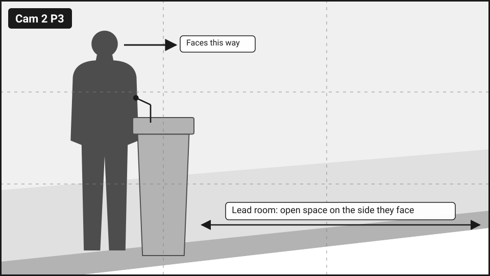
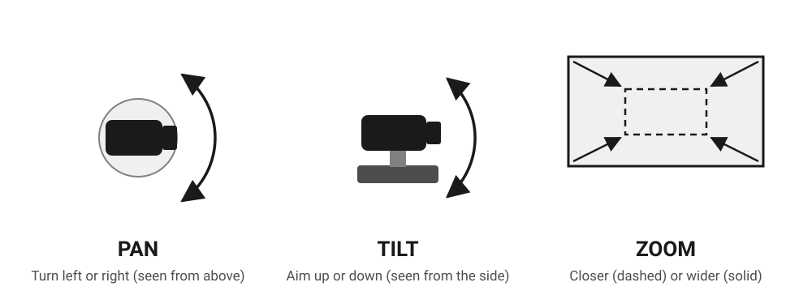
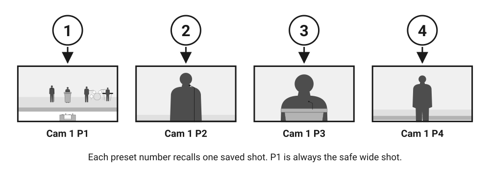
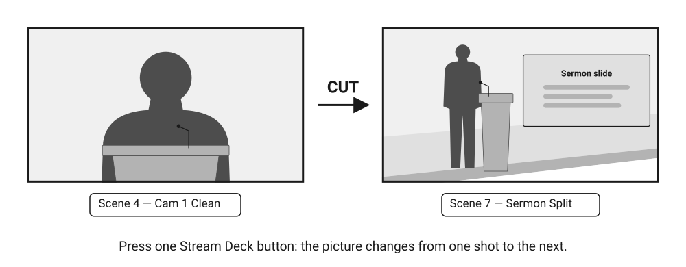
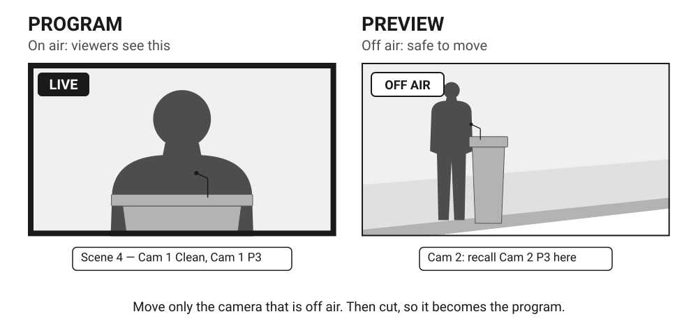

# Video Basics

This page is a picture glossary. It has the video words you'll see on this site, each with a drawing. You don't need to memorize them. Come back here whenever a word is unfamiliar.

The drawings are mock **frames**. A frame is one still picture of what the camera or the stream shows. The dark tag in the top-left corner names the shot, using the same label as the SuperJoy or Stream Deck button.

## Shot sizes

The **shot size** says how much of the person or the stage fills the frame.

<figure markdown="span">
  
  <figcaption><strong>Wide:</strong> the whole stage. Cam 1 P1.</figcaption>
</figure>

<figure markdown="span">
  
  <figcaption><strong>Medium:</strong> a few people, head to toe. Cam 1 P2.</figcaption>
</figure>

<figure markdown="span">
  
  <figcaption><strong>Upper body:</strong> chest up. Cam 1 P3.</figcaption>
</figure>

- **Wide shot:** shows the whole scene. Viewers see where everyone is. It is the safest shot, because nothing important is ever out of frame.
- **Medium shot:** closer than wide, showing part of the stage. Ours shows the worship leader with the people on either side, head to toe. Viewers can see who is leading and what they are doing.
- **Close-up:** a face or a small object fills the frame. We don't use real close-ups. Our tightest shot is the upper-body shot of the pulpit, Cam 1 P3.

## Headroom

**Headroom** is the space between the top of the head and the top of the frame. Keep a small gap. Too much makes the person look small and sunk to the bottom. None cuts off the top of the head.

<figure markdown="span">
  
  <figcaption>The arrow at the top marks the headroom.</figcaption>
</figure>

The presets already have the right headroom saved. You only need to notice when it looks wrong, for example when a tall guest speaker stands at the pulpit.

## Rule of thirds

The **rule of thirds** splits the frame into three columns and three rows. A shot looks balanced when the person stands on one of the lines instead of dead center. The dashed lines in the preset drawings show these thirds.

<figure markdown="span">
  
  <figcaption>Cam 2 P3 puts the preacher on the left third. The right side stays empty for the slide.</figcaption>
</figure>

## Lead room

**Lead room** is open space on the side of the frame a person is facing. A person who faces right should stand on the left, with space in front of them. Without lead room, the person looks squeezed against the edge.

<figure markdown="span">
  
  <figcaption>The preacher faces right, so the open space is on the right. Scene 7 — Sermon Split puts the slide in that space.</figcaption>
</figure>

## PTZ camera

A **PTZ camera** is a camera on a motor. **PTZ** stands for pan, tilt, zoom. You control it from the booth with the SuperJoy and never touch the camera itself. Both of our cameras are PTZ cameras.

<figure markdown="span">
  
  <figcaption><strong>Pan</strong> turns left or right. <strong>Tilt</strong> aims up or down. <strong>Zoom</strong> gets closer or wider.</figcaption>
</figure>

The motor is slow on purpose, so the camera moves smoothly. That means you can see every move on screen. This is why you [only move the camera that isn't live](rules.md#1-only-move-the-camera-that-isnt-live).

## Preset

A **preset** is a saved camera position: pan, tilt and zoom all stored together. You recall a preset with one button on the SuperJoy, and the camera moves there by itself. We write presets as camera + number, for example `Cam 1 P3`.

<figure markdown="span">
  
  <figcaption>Each number recalls one saved shot. <strong>P1 is always the safe wide shot</strong>, on both cameras.</figcaption>
</figure>

All presets are on the [Cameras and Presets](cameras-and-presets.md) page.

## Source and scene

A **source** is anything that gives a picture: Cam 1, Cam 2, ProPresenter Lyrics or ProPresenter Slides.

A **scene** is a finished picture built from one or more sources, already arranged. Each Stream Deck button gives you one scene. You never build a scene during the service; you just press its button.

<figure markdown="span">
  
  <figcaption>Scene 7 — Sermon Split combines two sources: Cam 2 on the left and ProPresenter Slides on the right.</figcaption>
</figure>

All scenes are on the [Scenes](scenes.md) page.

## Overlay and lower third

An **overlay** is a picture placed on top of the camera shot. A **lower third** is an overlay across the bottom third of the frame. Our lyrics always use a lower third.

<figure markdown="span">
  
  <figcaption>Lyrics as a lower-third overlay on Cam 1 (Scene 2 — Cam 1 + Lyrics).</figcaption>
</figure>

## Clean and full screen

A **clean** shot is a camera with nothing on top: no lyrics, no slide. **Full screen** means one source fills the whole frame, like a slide with no camera at all.

<figure markdown="span">
  
  <figcaption><strong>Clean:</strong> Scene 4 — Cam 1 Clean.</figcaption>
</figure>

<figure markdown="span">
  
  <figcaption><strong>Full screen:</strong> Scene 6 — Full Slide.</figcaption>
</figure>

## Cut

A **cut** is a switch from one shot to the next. On our setup, you cut by pressing a scene button on the Stream Deck.

<figure markdown="span">
  
  <figcaption>A cut from Scene 4 — Cam 1 Clean to Scene 7 — Sermon Split. One button press.</figcaption>
</figure>

## Program and preview

The **program** is the picture going out live right now. It is what viewers see. Whatever is in the program is **live** or **on air**.

The **preview** is a shot you get ready before it goes live. On our setup, that means the camera that is **off air**: the one not in the current scene. You can move the off-air camera, because nobody is watching it. When it's ready, you cut to it, and it becomes the program.

<figure markdown="span">
  
  <figcaption>Cam 1 is live, so don't move it. Cam 2 is off air, so you can recall a new preset on it.</figcaption>
</figure>

Which camera is live depends on the scene:

| Scene on air | Live camera | Off-air camera (safe to move) |
|---|---|---|
| 2 Cam 1 + Lyrics, 4 Cam 1 Clean | Cam 1 | Cam 2 |
| 3 Cam 2 + Lyrics, 5 Cam 2 Clean, 7 Sermon Split, 8 Break | Cam 2 | Cam 1 |
| 1 Countdown, 6 Full Slide, 9 End Slate | None | Both |

Where you watch the off-air camera at the booth (which screen or window): TBD. Your trainer will show you during the hands-on session.

## Other words on this site

| Word | Meaning |
|---|---|
| **Safe shot** | A shot that is never wrong: P1, the wide shot, on either camera. |
| **Exposure** | How bright the picture is and what color it has. Ours is fixed, so you never change it. See [Cameras and Presets](cameras-and-presets.md#exposure). |
| **Broadcasting** | Ecamm is sending the program out to Resi. |
| **Stream** | The live video viewers watch on YouTube and the church website. Resi sends it. |
| **T-30, T-60** | 30 or 60 minutes before the service starts. |
