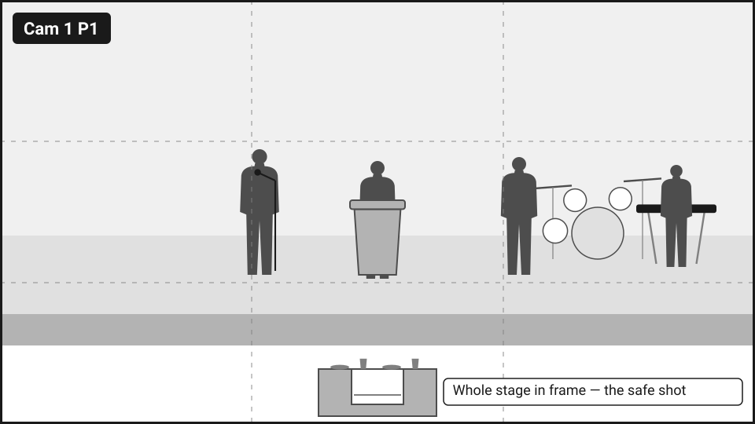
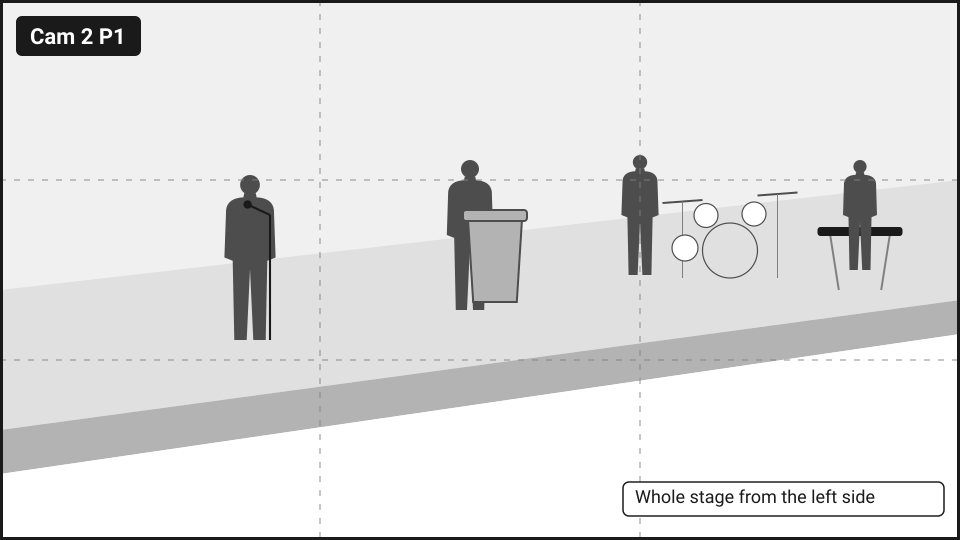
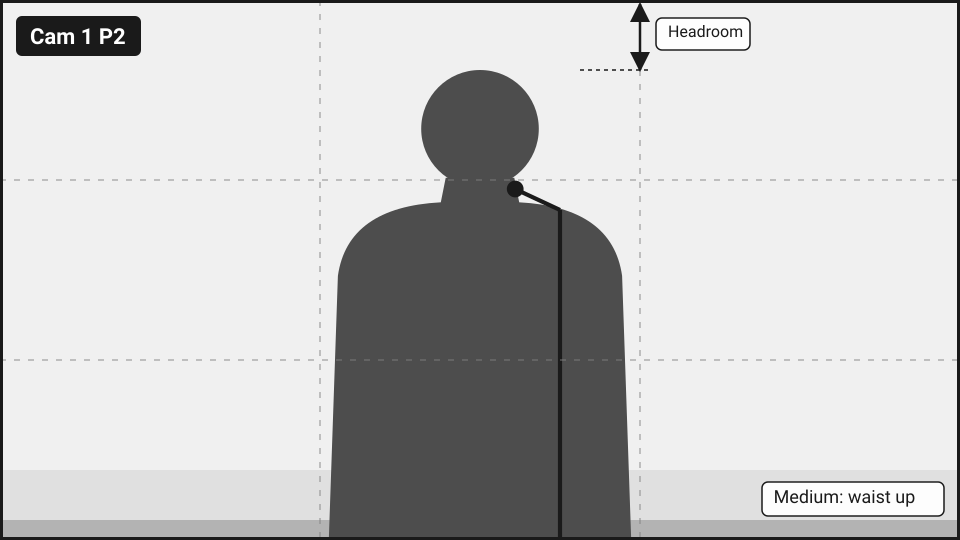
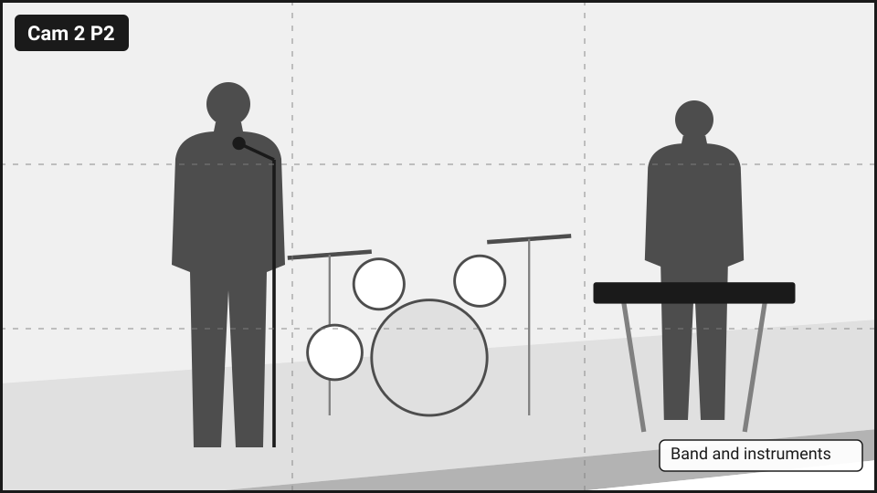
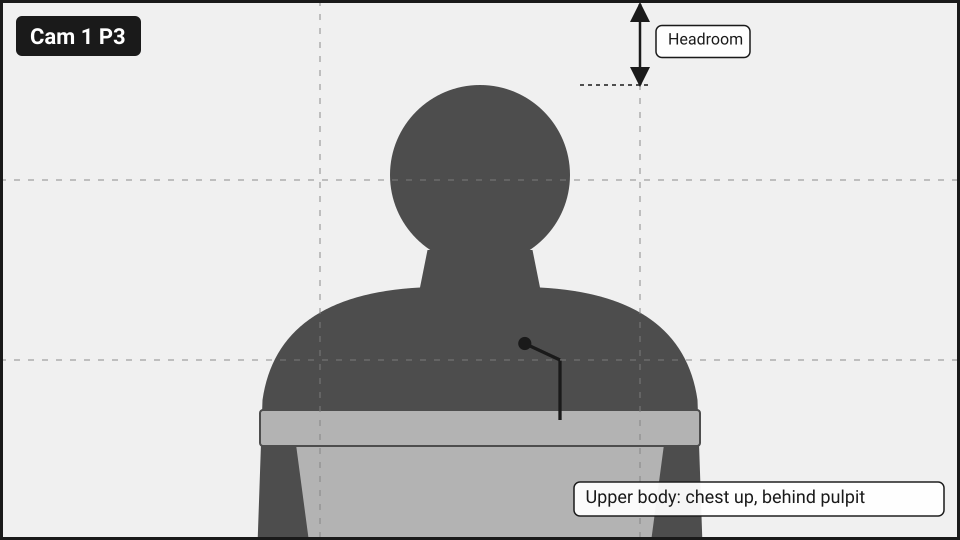
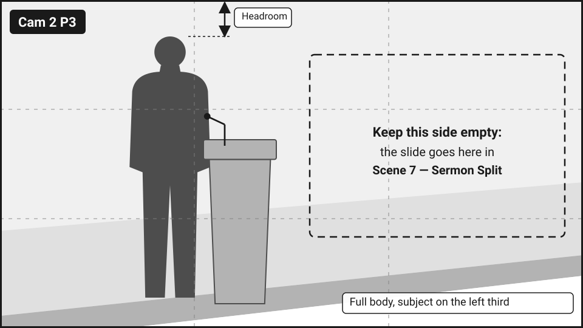
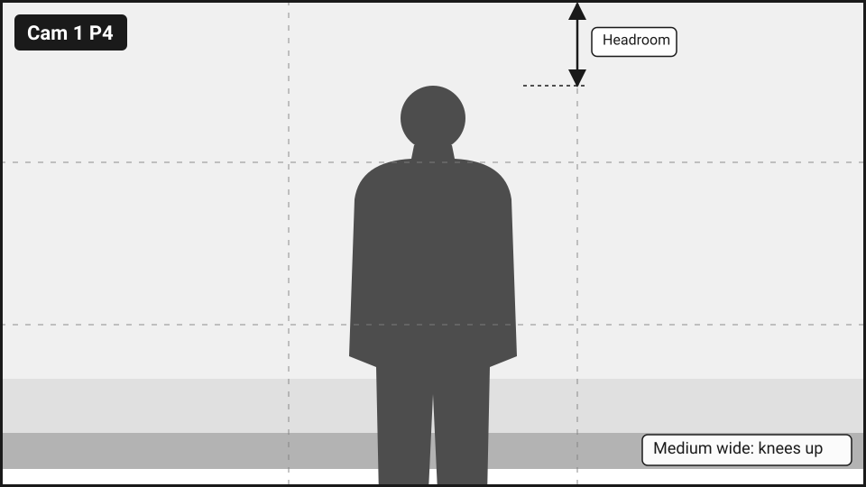
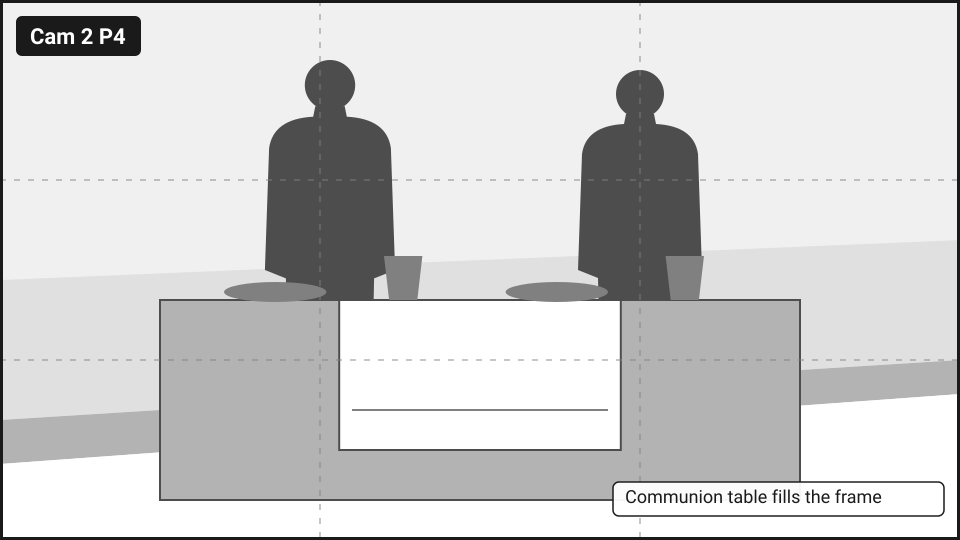
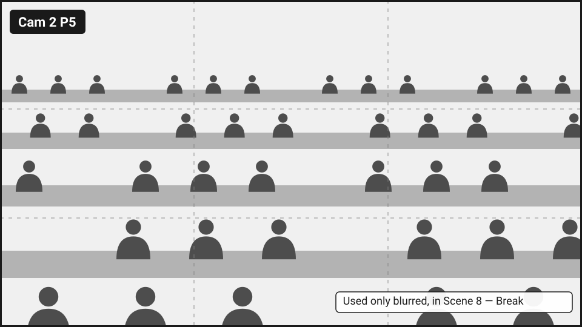

# Preset Map

**P1 is always the safe wide shot.** Same slot number = same kind of shot on both cameras.

!!! danger "Only move the camera that isn't live"
    Recall the preset on the off-air camera, wait for it to stop moving, then cut.

| # | Cam 1 — Center | | Cam 2 — Left side | |
|---|---|---|---|---|
| **P1** | { width="150" } | **Cam 1 P1** Full stage wide (safe shot) | { width="150" } | **Cam 2 P1** Side wide of stage (safe shot) |
| **P2** | { width="150" } | **Cam 1 P2** Worship leader, medium | { width="150" } | **Cam 2 P2** Band / instruments |
| **P3** | { width="150" } | **Cam 1 P3** Pulpit, upper body (sermon front) | { width="150" } | **Cam 2 P3** Pulpit, full body, subject framed left (for Sermon Split) |
| **P4** | { width="150" } | **Cam 1 P4** Announcements spot | { width="150" } | **Cam 2 P4** Communion table |
| **P5** | — | — | { width="150" } | **Cam 2 P5** Congregation wide (only used blurred, for Break) |

**Exposure:** fixed manual on both cameras (iris, shutter, gain, white balance), saved into every preset.
Cam 1: TBD. Cam 2: TBD.

PHOTO NEEDED: superjoy.jpg

Why each shot is framed this way: [Cameras and Presets](../onboarding/cameras-and-presets.md).
